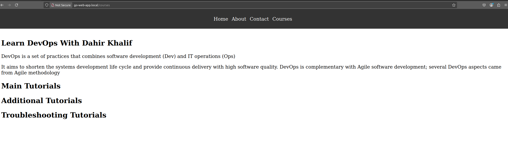
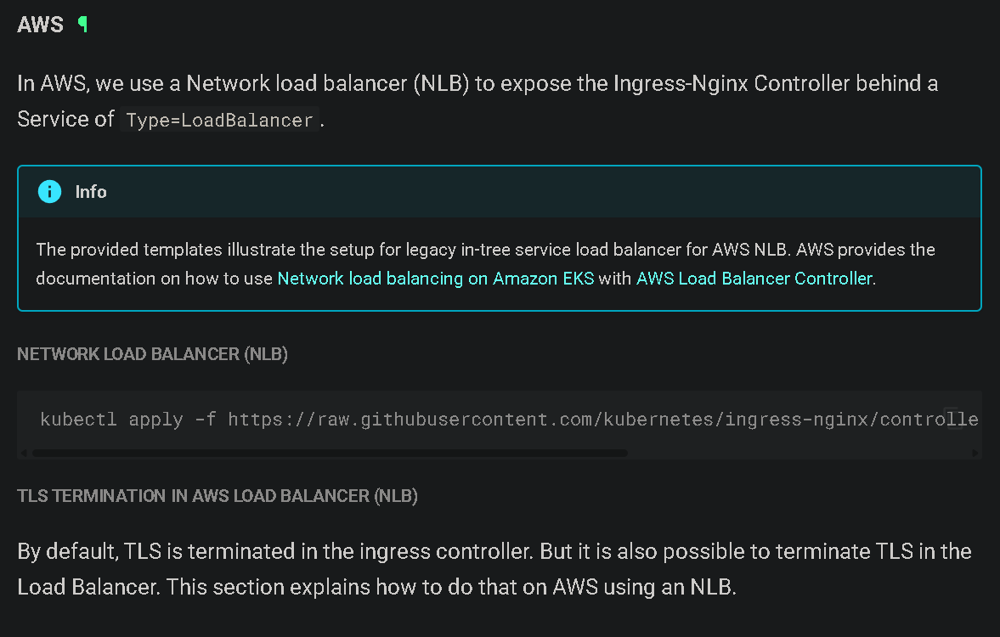
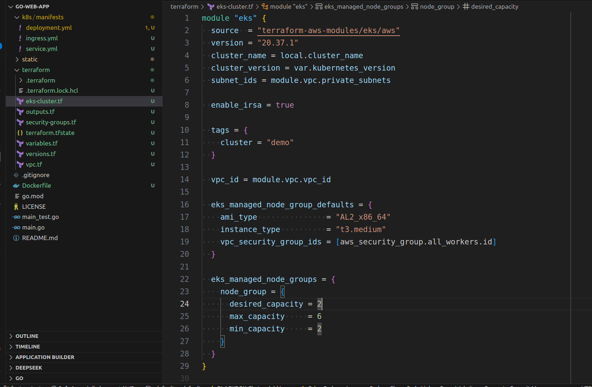
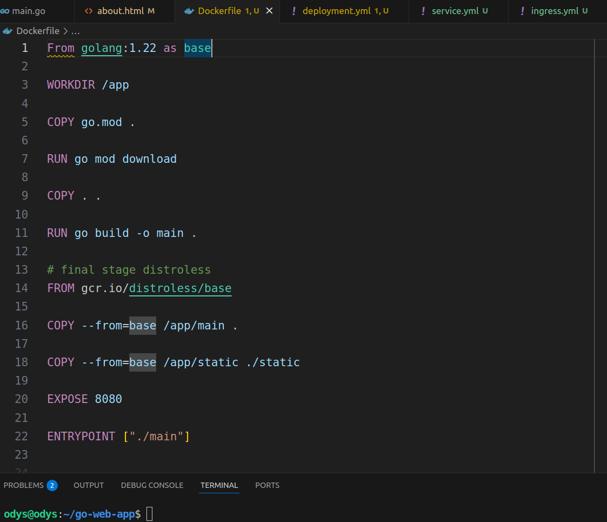
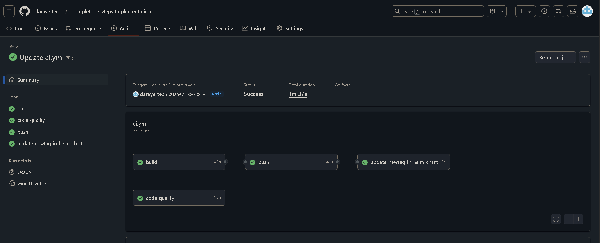
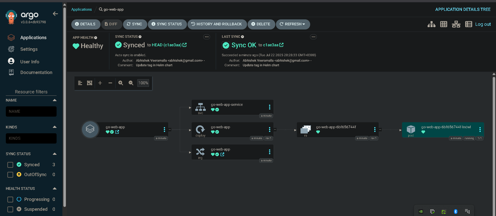

# Complete DevOps Implementation – Go Web Application

This project showcases a full end-to-end DevOps pipeline for a Golang-based web application. It includes source code, containerization, Kubernetes deployment, Helm chart management, infrastructure as code (Terraform on AWS), and CI/CD automation using GitHub Actions and GitOps with ArgoCD.


---

## Features

- **Golang Web Server:** Serves static HTML pages (`home`, `about`, `contact`, `courses`) using Go's `net/http`.
- **Dockerized:** Multi-stage Docker build for efficient, secure containers.
- **Kubernetes Ready:** Raw manifests and Helm chart for easy deployment.
- **Terraform Infrastructure:** AWS VPC, EKS cluster, and security groups.
- **CI/CD Automation:** GitHub Actions for build, test, lint, Docker push, and Helm tag update.
- **ArgoCD Integration:** GitOps-based continuous delivery and deployment status monitoring.

---

## Prerequisites

- Go 1.22+
- Docker
- kubectl
- Helm
- Terraform
- AWS CLI configured

---

## Directory Structure

.
├── main.go # Go web server
├── main_test.go # Unit tests
├── static/ # HTML & images
├── Dockerfile # Container build
├── helm/ # Helm chart
├── k8s/ # Kubernetes manifests
├── terraform/ # AWS infra as code
├── .github/workflows/ # CI/CD pipeline
├── go.mod # Go modules
├── README.md # Documentation
└── LICENSE # Apache 2.0

---

## Running Locally

```bash
go run main.go
Visit the application: http://localhost:8080/courses


---

## Screenshots

### 1. Courses Page


*Learn DevOps With Dahir Khalif – Courses section of the web app.*

---

### 2. AWS Documentation Example


*Example documentation for AWS Network Load Balancer integration.*

---

### 3. Terraform EKS Cluster Code


*Terraform code for provisioning AWS EKS cluster.*

---

### 4. Dockerfile in VS Code


*Multi-stage Dockerfile for building and packaging the Go app.*

---

### 5. GitHub Actions CI/CD Workflow


*Automated CI/CD pipeline for build, test, lint, Docker push, and Helm update.*

---

### 6. ArgoCD Application Sync


*ArgoCD dashboard showing healthy, synced Kubernetes resources.*

---

## Docker

```bash
docker build -t go-web-app .
docker run -p 8080:8080 go-web-app
```

---

## Kubernetes

Apply manifests:
```bash
kubectl apply -f k8s/manifests/
```

Or install via Helm:
```bash
helm install go-web-app ./helm/go-web-app-chart
```

---

## Terraform (AWS EKS)

```bash
cd terraform
terraform init
terraform apply
```

---

## CI/CD

Automated workflows in [`.github/workflows/ci.yml`](.github/workflows/ci.yml):

- Build & test
- Lint
- Docker build & push
- Helm chart tag update

---

## License

Apache License 2.0

---

## Author

Dahir Khalif

---

Feel free to contribute or open issues for improvements!


